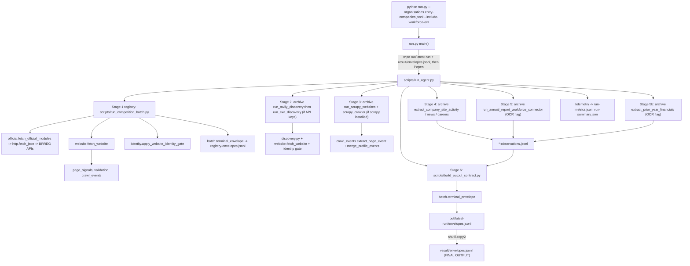

# SignalPost Company Agent: Codebase Map (AI Context File)

Traced from this command:

```bash
python run.py --organisations entry-companies.jsonl --include-workforce-ocr
```

Final output of that command: `result/envelopes.jsonl` (one JSON object per company, one per line).

---

## 0. How another AI should use this file

1. Treat sections 2 to 8 as the architecture ground truth. They were derived by reading the code and the shipped sample run in `out/latest-run/`.
2. Before deleting or renaming ANY file, read section 11 (dependency and safe-to-delete table) and section 12 (traps). Several things that look dead or archived are load-bearing.
3. Before adding a stage or module, follow the recipes in section 11.3.
4. Section 13 lists what was NOT read in depth. Do not assume those files behave as described beyond their signatures. Open them before editing.
5. The pipeline was NOT executed while writing this file. Runtime behavior is inferred from code plus the sample artifacts in `out/latest-run/` (20 companies).

---

## 1. What this project is

A batch agent for Norwegian companies. Input: a list of 9 digit organisation numbers. For each company it collects:

- Official registry data from BRREG (Bronnoysundregistrene) public APIs: entity, annual accounts, annual-account PDF list, roles, group structure, sub-units.
- A rule-based accounting-obligation classification.
- The company website (from the registry, or discovered via Tavily / Exa search APIs), verified by an identity gate before it is trusted.
- Optional deep crawl of the website with Scrapy, plus derived "observations" (site activity, news page, careers page).
- Optional annual-report OCR (pdftoppm + Tesseract, Norwegian) to extract workforce counts and prior-year financial figures.

Everything is packaged per company as a "fat envelope" and written to `result/envelopes.jsonl`. Each fact carries provenance (source URL, retrieval time, hash, status).

---

## 2. Ground truth: five facts that contradict what the repo looks like

| # | Appearance | Reality (verified in code) |
|---|---|---|
| 1 | `archive/v2-crawler/` is described as "intentionally excluded" (its README, and `docs/HACKATHON_V1_CLEANUP.md`) | `scripts/run_agent.py` calls `archive/v2-crawler/run_tavily_discovery.py`, `run_exa_discovery.py`, `run_scrapy_websites.py`, `extract_company_site_*.py`, `run_annual_report_workforce_connector.py`, `extract_prior_year_financials.py` by path (`ARCHIVE_ROOT`). The folder is LIVE. Deleting it breaks discovery, crawl, observations and OCR. |
| 2 | Phase docs (`02_PHASE_1_CLAIMS.md` to `08_PHASE_7_FINAL_VALIDATION.md`) describe a public envelope with `claims[]`, `evidence[]`, `changes[]`, `operations` built by `to_public_envelope()` | The live output is the FAT envelope: `{run_id, organisation_number, state, started_at, completed_at, modules, profile}` built by `batch.terminal_envelope()`. `output_contract.to_public_envelope()` and `changes.diff_claims()` are called only by tests. They are NOT wired into `run.py`. |
| 3 | `src/norway_company_agent/official.py` has `extract_annual_report_workforce()` and `fetch_google_news_mentions()` | `run_agent.py` passes `--modules registry,accounting_obligation,registry_live,financials,financial_history,roles,group,locations,website`. `workforce` and `google_news` are not in that list, so those two functions never run in the main command. Workforce comes from the separate archive connector. |
| 4 | `--include-workforce-ocr` looks like the only toggle | `run.py` also always forwards `--include-deep-crawl` unless you pass `--skip-deep-crawl`. Deep crawl is ON by default, but silently skipped if `scrapy` is not installed (and `requirements.txt` does not list scrapy). |
| 5 | `result/envelopes.jsonl` looks like a persistent file | `run.py` deletes it at the start of every run, and also deletes the whole `out/latest-run/` directory (including the OCR cache). Everything is recomputed every run. |

---

## 3. The command, flag by flag

```
python run.py --organisations entry-companies.jsonl --include-workforce-ocr
```

| Piece | Handled in | Effect |
|---|---|---|
| `--organisations entry-companies.jsonl` | `run.py` `main()` | Resolved relative to project root. Counted by `count_organisations()` (JSON array, or one non-empty line per company). Passed through to `run_agent.py`. NOTE: `entry-companies.jsonl` is actually a pretty-printed JSON array of 20 org-number strings despite the extension. |
| `--include-workforce-ocr` | `run.py` argparse: `dest="skip_workforce_ocr"`, `store_false`, default `True` | Sets `skip_workforce_ocr=False`, so `run.py` appends `--include-workforce-ocr` to the `run_agent.py` command. In `run_agent.py` it turns on stage 5 (OCR workforce) and stage 5b (prior-year financials). Without it, both stages are skipped. |
| (implicit) deep crawl | `run.py`: `skip_deep_crawl` default `False` | `run.py` appends `--include-deep-crawl` automatically. Pass `--skip-deep-crawl` to turn it off. |
| `--progress-interval` | `run.py` | Seconds between PROGRESS lines. Default 30. |
| `--source-envelopes FILE` | `run.py` | Skips collection. Runs `scripts/build_output_contract.py` on an existing envelope/profile JSONL and writes `result/envelopes.jsonl`. |

The effective subprocess command built by `run.py` (confirmed by `out/latest-run/run-metrics.json`):

```
python scripts/run_agent.py --organisations <abs path> --output-dir out/latest-run \
  --run-id run-<UTC timestamp> --expected-count <N> --include-workforce-ocr --include-deep-crawl
```

---

## 4. Directory tree with the role of every file

Status legend:
- **LIVE**: executed by the main command on every run.
- **LIVE-IF**: executed only under a condition (API key set, scrapy installed, OCR flag).
- **LIB**: imported by live code.
- **OFF-PATH**: not reached by the main command (used by tests, docs, or experiments only).
- **DATA / ARTIFACT / DOC**: not code.

```
signalpost-company-agent-main/
|-- run.py                          LIVE   Entry point. Wipes out/latest-run and result/envelopes.jsonl, spawns run_agent.py, prints progress, copies final envelopes to result/.
|-- scripts/
|   |-- run_agent.py                LIVE   Orchestrator. Runs all stages as subprocesses, merges profiles, builds metrics.
|   |-- run_competition_batch.py    LIVE   Stage 1. Threaded (max 12) per-company collection of BRREG modules + website.
|   |-- build_output_contract.py    LIVE   Stage 6. Profiles + observations -> fat envelopes JSONL. Also used by --source-envelopes.
|   |-- check_tesseract.py          OFF-PATH  Diagnostic for the Tesseract install (not read in depth).
|   |-- calibrate_identity_thresholds.py  OFF-PATH  Identity threshold calibration helper (not read in depth).
|   |-- run_linkedin_guest_experiment.py  OFF-PATH  Experiment.
|   `-- run_linkedin_guest_jobs_connector.py  OFF-PATH  Experiment.
|-- src/norway_company_agent/
|   |-- __init__.py                 LIB    Package marker.
|   |-- env.py                      LIB    load_local_env(): minimal .env parser, uses os.environ.setdefault (real env wins over .env).
|   |-- evidence.py                 LIB    Evidence dataclass + evidence() factory + utc_now(). The unit of provenance.
|   |-- http.py                     LIB    fetch_json(): urllib GET with 3 attempts, exponential backoff, telemetry logging. Used for all BRREG calls.
|   |-- telemetry.py                LIB    record_request() appends to SIGNALPOST_REQUEST_LOG; build_metrics(), aggregate_company_metrics(), apply_discovery_report() build run-metrics.json.
|   |-- batch.py                    LIB    profiles_from_inputs(), backfill_from_registry_live(), evidence_terminal_state(), terminal_envelope() (THE envelope builder), validate_envelopes().
|   |-- official.py                 LIB    BRREG endpoints + normalizers (entity, financials, history, roles, group, locations), accounting_obligation_assessment(), fetch_official_modules(). Also contains workforce OCR and Google News code that is NOT reached (see section 2, row 3).
|   |-- website.py                  LIB    fetch_website(): robots check, SSRF guard (assert_public_url), homepage + up to 6 priority pages, contact/job/news/social extraction, schema validation. normalize_website_value().
|   |-- identity.py                 LIB    Identity gate. assess_website_identity() returns ACCEPT / REVIEW / REJECT; apply_website_identity_gate() applies it to a website evidence record. Uses rapidfuzz. assess_social_identity() is unused.
|   |-- discovery.py                LIB    build_company_search_query(), parse_{tavily,exa,brave}_web_results(), score_search_candidate(), choose_search_candidate(), mark_direct_discovery(). "Method 2" ladder functions (discover_profiles_method2, apply_method2_discovery, should_try_method2) are not called by the main path.
|   |-- validation.py               LIB    Pydantic models (CrawlPageEvent, WebsitePageOutput, WebsiteDiscovery, WebsiteValue), validate_*(), append_quarantine_record().
|   |-- crawl_events.py             LIB    emit_crawl_event() (writes crawl-trace.jsonl), classify_failure_class(), extract_page_event() (HTML -> page event with forensics + snapshot), merge_profile_events(). REQUIRED by website.py, official.py, discovery.py, scrapy spider.
|   |-- page_signals.py             LIB    First-party structured signals from one page (JSON-LD, microdata, feeds, job and article cards). Imported by website.py and crawl_events.py. (Signatures only read.)
|   |-- website_forensics.py        LIB    build_page_forensics(): per-page diagnostic record used by crawl_events. (Signatures only read.)
|   |-- snapshot_store.py           LIB    save_snapshot(): content-addressed HTML saved under SIGNALPOST_SNAPSHOT_DIR (out/latest-run/snapshots/<2hex>/<sha256>.html).
|   |-- operations.py               LIB    latency/percentile helpers, peak RSS. Imported only by run_scrapy_websites.py.
|   |-- output_contract.py          OFF-PATH  to_public_envelope(), claim/evidence integrity assertions. Imported only by tests. Imports changes.py.
|   |-- changes.py                  OFF-PATH  diff_claims(): claim-level change detection. Imported by output_contract.py and tests.
|   |-- research.py                 OFF-PATH  Deterministic screen/answer layer over profiles (answer_profile, parse_screen_query, screen_profiles). No callers found.
|   `-- workspace.py                OFF-PATH  Pins/history store for screens. No callers found.
|-- archive/v2-crawler/             (name is misleading; see section 2, row 1)
|   |-- run_tavily_discovery.py     LIVE-IF  Stage 2a. Needs TAVILY_API_KEY set (run_agent skips if empty).
|   |-- run_exa_discovery.py        LIVE-IF  Stage 2b. Needs EXA_API_KEY set. Same outcome logic as Tavily.
|   |-- run_scrapy_websites.py      LIVE-IF  Stage 3. Needs `import scrapy` to succeed and deep crawl not skipped.
|   |-- scrapy_crawler.py           LIVE-IF  Scrapy spider SignalpostWebsiteSpider + middlewares. Imported by run_scrapy_websites.py.
|   |-- extract_company_site_activity.py   LIVE-IF  Stage 4a (only after a successful crawl).
|   |-- extract_company_site_news.py       LIVE-IF  Stage 4b.
|   |-- extract_company_site_careers.py    LIVE-IF  Stage 4c.
|   |-- run_annual_report_workforce_connector.py  LIVE-IF  Stage 5 (needs --include-workforce-ocr). Download PDF, pypdf text, OCR fallback, regex extraction.
|   |-- extract_prior_year_financials.py   LIVE-IF  Stage 5b (needs OCR flag and the workforce cache dir).
|   |-- run_brave_discovery.py, run_google_news_rss_connector.py, run_youtube_search_connector.py,
|   |   run_linkedin_guest_experiment.py, run_linkedin_guest_jobs_connector.py, discover_linkedin_company_profiles.py,
|   |   external_control.py, external_footprint.py, external_tasks.py, sentiment.py, refresh.py, snapshots.py
|   |                               OFF-PATH  Never called by run_agent.py. Experiments / older connectors.
|   |-- crawl_events.py             OFF-PATH  Stale duplicate. The live module is src/norway_company_agent/crawl_events.py.
|   `-- README.md                   DOC    Claims V1 is "crawler-free". Wrong relative to run_agent.py.
|-- tests/                          OFF-PATH  4 pytest files. Three import output_contract / changes / website_forensics / website. One (test_annual_report_workforce_connector.py) loads archive/v2-crawler/run_annual_report_workforce_connector.py by path, so it breaks if that file moves. None cover run.py or run_agent.py.
|-- _p6_verify.py                   OFF-PATH  Ad hoc script for Phase 6 (changes).
|-- run.bat / setup.bat             Windows wrappers. run.bat hardcodes 1000-companies.jsonl. setup.bat = pip install -r requirements.txt.
|-- requirements.txt                beautifulsoup4, extruct, pydantic, rapidfuzz, tldextract, trafilatura, pypdf. Missing: scrapy (and lxml is used but not listed).
|-- .env / .env.example             CONFIG  EXA_API_KEY, TAVILY_API_KEY, BRAVE_SEARCH_API_KEY, TAVILY_USD_PER_CREDIT. SECURITY: the shipped .env contains real key values (see section 12).
|-- entry-companies.jsonl           DATA   20 org numbers (JSON array in a .jsonl file).
|-- 1000-companies.jsonl            DATA   1000 org numbers.
|-- out/latest-run/                 ARTIFACT  Created and wiped by every run. Shipped sample from a 20 company run.
|-- result/                         ARTIFACT  envelopes.jsonl (final, created per run). envelopes_v2.jsonl / envelopes_v3.jsonl are manual snapshots, not written by code.
|-- 02..08_PHASE_*.md, SignalPost_*_Plan.md, docs/*.md   DOC  Design history. The claims/public-envelope design in them is NOT what the live output looks like.
`-- .pytest_cache/, .gitignore (".env" only)
```

---

## 5. Execution trace (the actual call chain)

### 5.1 `run.py` `main()`

1. Parse args. `load_local_env(PROJECT_ROOT)` loads `.env` into `os.environ` (setdefault).
2. `configure_tesseract_path()`: use `tesseract` from PATH, else `C:\Program Files\Tesseract-OCR` (or `TESSERACT_DIR`) and prepend to PATH. Poppler (`pdftoppm`) is not configured here.
3. Validate input exists, non-empty. `expected_count = count_organisations()`.
4. `run_id = "run-" + UTC timestamp`.
5. DESTRUCTIVE: `shutil.rmtree(out/latest-run)`, delete `out/<9digits>.jsonl`, delete `result/envelopes.jsonl`.
6. Spawn `subprocess.Popen([python, scripts/run_agent.py, ...])` with cwd = project root.
7. Poll `out/latest-run/progress.json` and `progress-stage.txt` every `--progress-interval` seconds and print `PROGRESS | companies=x/N | ...`.
8. After exit: if return code non-zero but envelopes >= expected, treat as success. If non-zero with some envelopes, copy partial output to `result/envelopes.jsonl` and return the error code. If success, `shutil.copy2(out/latest-run/envelopes.jsonl, result/envelopes.jsonl)`.

### 5.2 `scripts/run_agent.py` `main()`

Sets env vars for child processes: `SIGNALPOST_REQUEST_LOG=<out>/request-log.jsonl`, `SIGNALPOST_SNAPSHOT_DIR=<out>/snapshots`, `SIGNALPOST_RUN_ID`, `SIGNALPOST_CALLER_MODULE=run_agent`. Each stage is a `subprocess.run` of another script. `run_stage()` writes the stage name into `progress-stage.txt` and records timing. Stages marked optional do not abort the run on failure.

| Order | Stage name (progress-stage.txt) | Script | Required? | Condition | Reads | Writes |
|---|---|---|---|---|---|---|
| 1 | `registry` | `scripts/run_competition_batch.py` | YES (failure aborts, no envelopes) | always | org list | `profiles.jsonl`, `registry-envelopes.jsonl`, `registry-report.json`, `progress.json` |
| 2a | `discovery` | `archive/v2-crawler/run_tavily_discovery.py` | optional | `TAVILY_API_KEY` non-empty | `profiles.jsonl` | `profiles-with-tavily.jsonl`, `tavily-discovery-report.json` |
| 2b | `discovery` | `archive/v2-crawler/run_exa_discovery.py` | optional | `EXA_API_KEY` non-empty | output of 2a if it succeeded | `profiles-with-exa.jsonl`, `exa-discovery-report.json` |
| (merge) | | in-process | | | latest profiles file | overwrites `profiles.jsonl` after `backfill_top_level_website()` |
| 3 | `crawling` | `archive/v2-crawler/run_scrapy_websites.py` | optional | `import scrapy` works AND not `--skip-deep-crawl` | `crawl-input.jsonl` (profiles that have a `website`) | `profiles-crawled.jsonl`, `crawl-events.jsonl`, `crawl-jobdir/`, `crawl-report.json`, `website-forensics.jsonl`, `website-forensic-summary.json` |
| (merge) | | in-process | | | | `merge_profiles()` replaces whole profile rows by org number, rewrites `profiles.jsonl` |
| 4a | `claims/evidence` | `extract_company_site_activity.py` | optional | after successful crawl | `profiles.jsonl` | `activity-observations.jsonl`, `activity-report.json` |
| 4b | `claims/evidence` | `extract_company_site_news.py` | optional | same | | `news-observations.jsonl`, `news-report.json` |
| 4c | `claims/evidence` | `extract_company_site_careers.py` | optional | same | | `careers-observations.jsonl`, `careers-report.json` |
| 5 | (none; uses `run()` not `run_stage()`) | `run_annual_report_workforce_connector.py` | optional | `--include-workforce-ocr` | `profiles.jsonl`, `all-orgs.txt` | `workforce-observations.jsonl`, `workforce-report.json`, `workforce-cache/` (PDFs, `-extracted.txt`, `-ocr-15-130.txt`) |
| 5b | (none) | `extract_prior_year_financials.py` | optional | OCR flag AND `workforce-cache/` exists | `profiles.jsonl`, cache | `prior-year-financials-observations.jsonl`, `prior-year-financials-report.json` |
| 6 | `claims/evidence` | `scripts/build_output_contract.py` | YES | always | `profiles.jsonl` + every existing observation file | `envelopes.jsonl`, `contract-report.json` |
| 7 | `output` | `scripts/build_viewer.py` | optional | file exists | | The file does NOT exist in this repo. Always skipped with a message. |
| end | | in-process | | `request-log.jsonl` | `run-summary.json`, `run-metrics.json` |

Stages 5 and 5b run only when the OCR flag is present, and stage 5b additionally needs the cache that stage 5 creates.

### 5.3 Stage 1 in detail: `run_competition_batch.py`

1. `read_orgs()` reads org numbers from a JSON array, or JSONL (plain line, or JSON object with `organisation_number` / `org` / `id`). NO 9 digit validation and NO duplicate check here. (`batch.read_organisation_inputs()` has both checks but is not used.)
2. `profiles_from_inputs()` creates hint-only profiles with `evidence.registry = not_applicable`.
3. `ThreadPoolExecutor(max_workers=min(12, N))` runs `collect_profile()` per company:
   1. `official.fetch_official_modules(org, modules & {registry_live, financials, financial_history, roles, group, locations})`: sequential GETs via `http.fetch_json` in this order: entity, accounts, account-year list, roles, group structure, sub-units. Each response is normalized and wrapped by `_classified()` into an evidence record (200 -> `available`, 404/410 -> `not_found`, else `source_error`).
   2. `batch.backfill_from_registry_live(profile)`: copies name, legal form, employees, bankrupt, liquidating, website, latest accounts, municipality, industry from live registry into top-level profile fields.
   3. `official.accounting_obligation_assessment(profile)` -> `evidence.accounting_obligation` (rule classification: `filing_observed`, `required_by_legal_form`, `threshold_or_activity_dependent`, `special_rule_or_review_required`).
   4. `website.fetch_website(profile.website)` then `identity.apply_website_identity_gate()` -> `evidence.website`. If the registry has no website, `fetch_website` returns `not_found` immediately (17 of 20 companies in the sample run).
   5. Any exception is caught: profile gets `_batch_state="failed"` and every requested module gets a `source_error` evidence record, so an envelope is still produced.
4. Writes `profiles.jsonl`, and `registry-envelopes.jsonl` via `batch.terminal_envelope()`, plus `registry-report.json`.
5. `ProgressTracker` atomically rewrites `progress.json` (temp file + `os.replace`) after each company. `run.py` reads it.

### 5.4 `website.fetch_website()` (used in stages 1 and 2)

`assert_public_url` (blocks localhost, private/reserved IPs, also on redirects) -> `robots.txt` check (allow if robots.txt missing) -> GET homepage (limit 2 MB, HTML only; HTTP fallback if the scheme was not supplied) -> extruct JSON-LD/microdata/OpenGraph, trafilatura text, social links, contact signals via `page_signals.extract_page_signals` -> `_priority_links()` picks up to 6 same-domain pages by keyword (about, contact, management, team, locations, news, careers/jobs, Norwegian equivalents) -> `_fetch_secondary_page()` for each (robots checked, 1 MB cap, same registered domain) -> `normalize_website_value()` -> `validation.validate_website_value()` (Pydantic; failures are quarantined and returned as `source_error` "failed schema validation"). Emits `crawl-trace.jsonl` events throughout.

### 5.5 Identity gate (`identity.py`)

`assess_website_identity()` compares the fetched site against registry data: org number found on page, legal-name token match, structured organisation records, address match, rapidfuzz name similarity. Result `decision`: `ACCEPT` (publishable true, status `exact`), `REVIEW` (status `review`), `REJECT` (status `rejected`). `apply_website_identity_gate()` attaches the assessment to `value.identity_assessment`, renames `social_links` to `discovered_social_links`, and if `REJECT` converts the website evidence to `source_error`. Calibration file `identity-calibration.json` (project root) is read if present; it is absent here, so calibration status is "uncalibrated".

### 5.6 Stage 2: discovery (Tavily, then Exa)

Per profile, in order: skip if the profile already has a website (`discovery_outcome="skipped_registry_website_present"`); skip if no name; else build a query (`discovery.build_company_search_query`), call the provider API, score and filter candidates (`choose_search_candidate`), and if one passes, `fetch_website()` the candidate and run the identity gate. Outcomes written on each row: `discovery_attempted`, `discovery_provider`, `discovery_outcome` in {`verified`, `quarantined`, `abstained`, `skipped_*`}. Evidence written: `evidence.website_discovery` (summary, no raw search results kept) and `evidence.website_discovered` (the independently fetched page). With `--promote-verified` (always passed), a verified site is copied into `evidence.website` and `profile.website`. Exa only sees profiles still lacking a website after Tavily. Limit = `expected_count`.

### 5.7 Stage 3: Scrapy crawl

`run_scrapy_websites.py` runs `SignalpostWebsiteSpider` (robots obeyed, autothrottle, 10 s timeout, 2 MB max, concurrency 16, 2 per domain, resumable via `crawl-jobdir/`). Homepage first, then up to 6 priority links (same `_priority_links` as stdlib crawler). Every page becomes a page event (`crawl_events.extract_page_event`). The runner validates events, dedupes, merges per org with `merge_profile_events`, validates `WebsiteValue`, re-applies the identity gate, rewrites rows, and writes forensics. NOTE: sites are fetched twice overall (stdlib in stage 1, Scrapy here).

### 5.8 Stage 4: observations from the crawl

Each extractor emits at most one observation per company, and only if `evidence.website.status == available` AND `identity_assessment.publishable`:
- activity: `signal_type=profile_metrics` (count of captured pages, verified socials; explicitly "not traffic").
- news: `signal_type=public_post`, one news-path page (`/news|press|aktuelt|nyheter|artikler|blog`).
- careers: `signal_type=careers_page_found`, a careers/jobs path page. Does not count open positions.

### 5.9 Stage 5 and 5b: OCR workforce and prior-year financials

Archive connector, per company, 3 worker threads:
1. Skip with status `registry_count_already_available` if BRREG already has an employee count.
2. Take the newest PDF URL from `evidence.financial_history.value.pdfs`, download (cached in `workforce-cache/<org>-<year>.pdf`).
3. Extract text with pypdf. If text is short or lacks workforce terms, OCR the first 15 pages at 130 DPI (`pdftoppm` -> `tesseract -l nor --psm 6`), cached as `<org>-<year>-ocr-15-130.txt`.
4. Require the org number to appear in the document, then run priority-ranked Norwegian regexes (arsverk / ansatte phrases). Group (konsern) phrases and conflicting values are rejected.
5. Emit `signal_type=workforce_snapshot`, `platform=brreg`, `metrics={workforce_value, measure, year, scope}`.

5b reads the same cache and recovers prior-year figures by anchoring on the known current-year value from `financials` (exact prefix match, otherwise abstain). Emits `signal_type=prior_year_financials`.

Sample run: 20 eligible, 15 accepted, 5 skipped because the registry already had counts.

### 5.10 Stage 6: `build_output_contract.py`

Reads profiles, groups all observation files by `organisation_number`, and for each profile:
`profile["observations"] = [...]` then `batch.terminal_envelope(profile, run_id, modules=list(profile.evidence.keys()), started_at, completed_at)`. If an input row is already an envelope (`profile` and `modules` keys), it is deep-copied and only `run_id`, timestamps and observations are updated.

---

## 6. Call graph



Module import dependencies inside `src/norway_company_agent/` (A -> B means A imports B):

```
batch -> evidence
official -> crawl_events, evidence, http
http -> telemetry
website -> evidence, page_signals, telemetry, (lazy) crawl_events, discovery, validation
discovery -> crawl_events, identity, telemetry, website
crawl_events -> evidence, page_signals, snapshot_store, website, website_forensics
page_signals -> snapshot_store, website
website_forensics -> page_signals
output_contract -> changes, website            (OFF-PATH)
workspace -> evidence                          (OFF-PATH)
research, changes, identity, validation, telemetry, snapshot_store, env, operations: no internal imports (except as listed above)
```

`website.py` and `crawl_events.py` import each other; this is handled with function-local imports. Do not hoist them to module level.

---

## 7. Data model

### 7.1 Evidence record (`evidence.py`)

```
{ field, status, source_type, source_class, source_url, retrieved_at,
  value, as_of, note, content_sha256, source_row_key, effective_at }
status in: available | not_found | not_applicable | not_fetched | source_error | blocked
```

### 7.2 Profile (one per company, `profiles.jsonl`)

```
organisation_number, name, legal_form, employees, bankrupt, liquidating, municipality,
municipality_number, industry_code, industry_label, website, latest_submitted_accounts,
input_metadata, _batch_state ("ok" | "failed"),
discovery_attempted, discovery_provider, discovery_outcome   (only if stage 2 touched the row),
evidence: { registry, registry_live, financials, financial_history, roles, group, locations,
            accounting_obligation, website, [website_discovery, website_discovered] },
observations: [...]    (added in stage 6)
```

Value shapes by evidence module (from the sample run):
- `registry_live.value`: organisation_number, name, legal_form, employees, bankrupt, liquidating, website, industry, business_address, postal_address, latest_submitted_accounts
- `financials.value`: `{records: [up to 3 of {record_id, account_type, period, currency, revenue, operating_result, profit_before_tax, annual_result, assets, equity, debt}]}`
- `financial_history.value`: `{years: [...], pdfs: [{year, url}]}`
- `roles.value`: `{roles: [{name, organisation_number, role_code, role, group_code, group, last_changed, inactive}]}`
- `locations.value`: `{locations: [{organisation_number, name, address, industry, employees}]}`
- `accounting_obligation.value`: classification, legal_form, latest_submitted_accounts, reason, ruleset_version
- `website.value`: requested_url, final_url, registered_domain, title, description, main_text_excerpt, structured_organisations, pages[], identity_assessment, org_number_found, legal_name_match, address_match, extraction_state, content_sha256, crawl_errors, discovery, cost_usd, jobs, news, phones, emails, addresses, locations, social_profiles, discovered_social_links. Missing fields are the literal string `"not_available"`.

### 7.3 Observation (added from stage 4, 5, 5b)

```
{ id, organisation_number, platform, signal_type, source_url, retrieved_at, content_sha256,
  exact_entity, identity_proof[], acquisition_mode, rights_status, source_class,
  evidence_span, [effective_at], metrics{}, strategy }
```
Observed `(platform, signal_type)` pairs in the sample: `(brreg, workforce_snapshot)`, `(brreg, prior_year_financials)`, `(company_site, profile_metrics)`.

### 7.4 Final envelope (what `result/envelopes.jsonl` contains)

```
{ run_id, organisation_number, state, started_at, completed_at,
  modules: { <module>: { state, retry_count, final_timestamp } , ... },
  profile: <the profile above> }
```

`evidence.status` to `modules[*].state` mapping (`batch.evidence_terminal_state`):
`available -> complete`, `not_applicable -> not_applicable`, `not_found -> not_found`, `blocked -> blocked_robots` (note contains "robot") or `blocked_policy`, `source_error -> source_error`, anything else -> `submission_error`.

Entity `state` is `submission_error` ONLY if some module is `submission_error`; otherwise `complete`. A company where every module failed with `source_error` still gets `state: "complete"`.

`modules` keys come from `profile.evidence.keys()`, so they are not uniform across rows. In the sample: 13 rows have `website_discovery`; 5 rows have `website_discovery` and `website_discovered`; 2 rows have neither.

---

## 8. Output files and who writes them

Final: `result/envelopes.jsonl` (copied by `run.py` from `out/latest-run/envelopes.jsonl`).

Inside `out/latest-run/` (all recreated each run):

| File | Writer |
|---|---|
| `progress.json`, `progress-stage.txt` | `run_competition_batch.ProgressTracker`, `run_agent.run_stage` |
| `profiles.jsonl` | stage 1, then overwritten by `run_agent` after discovery/crawl merges |
| `registry-envelopes.jsonl`, `registry-report.json` | stage 1 |
| `profiles-with-tavily.jsonl`, `tavily-discovery-report.json`, `profiles-with-exa.jsonl`, `exa-discovery-report.json` | stage 2 |
| `crawl-input.jsonl`, `profiles-crawled.jsonl`, `crawl-events.jsonl`, `crawl-report.json`, `website-forensics.jsonl`, `website-forensic-summary.json`, `crawl-jobdir/` | stage 3 |
| `activity|news|careers-observations.jsonl` and `*-report.json` | stage 4 |
| `all-orgs.txt`, `workforce-observations.jsonl`, `workforce-report.json`, `workforce-cache/` | stage 5 |
| `prior-year-financials-observations.jsonl`, `prior-year-financials-report.json` | stage 5b |
| `envelopes.jsonl`, `contract-report.json` | stage 6 |
| `request-log.jsonl` | `telemetry.record_request` (every HTTP call, all stages) |
| `crawl-trace.jsonl` | `crawl_events.emit_crawl_event` |
| `snapshots/<2hex>/<sha256>.html` | `snapshot_store.save_snapshot` |
| `run-summary.json`, `run-metrics.json` | `run_agent` end of run |
| `validation-quarantine.jsonl` | `validation.append_quarantine_record` (only on schema rejections) |

Sample run facts (shipped in `out/latest-run/`): 20 companies, 657 s total, stages_run = registry_batch, tavily_discovery, exa_discovery, deep_crawl, site_activity, site_news, site_careers, workforce_ocr, prior_year_financials, claims_conversion. 245 HTTP calls logged. Websites: 17 not found, 2 available, 1 source_error. Discovery outcomes: 15 abstained, 2 quarantined, 3 skipped (registry already had a site). Observations: 15 workforce, 15 prior-year, 1 site activity.

---

## 9. Configuration and external dependencies

Environment (from `.env`, loaded by `env.load_local_env`; real environment variables take priority):
- `TAVILY_API_KEY`: enables stage 2a. `run_agent` skips the provider if empty. (The Tavily script itself has a keyless mode, but `run_agent` never reaches it without a key.)
- `EXA_API_KEY`: enables stage 2b.
- `BRAVE_SEARCH_API_KEY`: used only by `archive/v2-crawler/run_brave_discovery.py` (off path).
- `TAVILY_USD_PER_CREDIT`: cost accounting for telemetry.
- Set by `run_agent`: `SIGNALPOST_REQUEST_LOG`, `SIGNALPOST_SNAPSHOT_DIR`, `SIGNALPOST_RUN_ID`, `SIGNALPOST_CALLER_MODULE`.
- Read but NOT set by `run_agent`: `SIGNALPOST_OUTPUT_DIR` (default `out/latest-run`, relative to cwd) used by `crawl_events` and `validation` for `crawl-trace.jsonl` and the quarantine file; `SIGNALPOST_CRAWL_TRACE_PATH`, `SIGNALPOST_QUARANTINE_PATH`; `TESSERACT_DIR` (run.py).

Python packages: those in `requirements.txt`, plus `scrapy` (required for stages 3 and 4, NOT listed), `lxml` (used as BeautifulSoup parser, not listed), `psutil` (optional, Windows peak RSS, imported lazily).

System binaries for OCR: `pdftoppm` (Poppler) and `tesseract` with the Norwegian language data (`nor`). If missing, the archive connector reports a per-company error `OCR required but missing executable(s)` and continues.

External services: BRREG (`data.brreg.no`: enhetsregisteret, regnskapsregisteret), Tavily API, Exa API, the companies' own websites. Python 3.10+.

---

## 10. Failure semantics (what happens when things break)

- Stage 1 crashes: `run_agent` raises, no `envelopes.jsonl` is produced, `run.py` returns an error. Nothing is copied to `result/`.
- A single company crashes in stage 1: caught, `_batch_state="failed"`, modules filled with `source_error`, envelope still emitted, entity `state` still `complete`.
- Any optional stage fails: logged to stderr, pipeline continues, that stage's observation file may be missing and the stage name is absent from `run-summary.json` `stages_run`.
- Stage 6 failure: no envelopes. `run.py` reports failure.
- `run.py` return-code override: if `run_agent` exits non-zero but `envelopes.jsonl` has at least `expected_count` lines, `run.py` treats it as success.

---

## 11. Modifying the codebase: dependencies and safe-to-delete

### 11.1 Never delete (the main command breaks)

`run.py`, `scripts/run_agent.py`, `scripts/run_competition_batch.py`, `scripts/build_output_contract.py`, and in `src/norway_company_agent/`: `__init__`, `env`, `evidence`, `http`, `telemetry`, `batch`, `official`, `website`, `identity`, `discovery`, `validation`, `crawl_events`, `page_signals`, `website_forensics`, `snapshot_store`.

### 11.2 Delete only if you also remove the stage that calls it

| Files | Called by | If removed, also edit |
|---|---|---|
| `archive/v2-crawler/run_tavily_discovery.py`, `run_exa_discovery.py` | `run_agent.py` stage 2 loop | the `for name, script, env_var in (...)` tuple |
| `archive/v2-crawler/run_scrapy_websites.py`, `scrapy_crawler.py` | stage 3 | the whole `if has_scrapy:` block (stage 4 extractors depend on it) |
| `src/.../operations.py` | `run_scrapy_websites.py` | goes with stage 3 |
| `archive/v2-crawler/extract_company_site_{activity,news,careers}.py` | stage 4 | the three `run_stage(...)` lines and the obs-path tuple in stage 6 |
| `archive/v2-crawler/run_annual_report_workforce_connector.py`, `extract_prior_year_financials.py` | stage 5, 5b | the `if not args.skip_workforce_ocr` blocks and the stage 6 obs tuple |

### 11.3 Not reached by the main command (safe w.r.t. the run, but check tests/docs)

`src/.../output_contract.py`, `changes.py` (tests import them: removing breaks `tests/test_phase1_website_contract.py`, `test_phase2_evidence_linkage.py`, `test_phase6_changes.py`), `research.py`, `workspace.py`, `tests/`, `_p6_verify.py`, `scripts/{check_tesseract,calibrate_identity_thresholds,run_linkedin_*}.py`, and in `archive/v2-crawler/`: `run_brave_discovery.py`, `run_google_news_rss_connector.py`, `run_youtube_search_connector.py`, `run_linkedin_*`, `discover_linkedin_company_profiles.py`, `external_*.py`, `sentiment.py`, `refresh.py`, `snapshots.py`, and the stale duplicate `crawl_events.py`.

Do NOT follow `docs/HACKATHON_V1_CLEANUP.md` blindly: it lists `src/.../crawl_events.py` for removal, but `website.py`, `official.py` and `discovery.py` import it. It also references old paths (`scripts/run_scrapy_websites.py` etc.) that have since moved to `archive/v2-crawler/`.

### 11.4 Recipes

**Add a new observation source (new stage)**
1. Write a script that outputs a JSONL where every row has `organisation_number` plus the observation fields in section 7.3.
2. In `scripts/run_agent.py`, add a `run_stage(name, [python, script, ...], optional=True)` before the "6. Claims/evidence conversion" block.
3. Add its output path to the tuple `for obs_path in (activity_obs_path, news_obs_path, ...)` in stage 6 so it is passed as `--observations`.
4. No other change is needed: `build_output_contract.py` groups by org number and attaches to `profile.observations`.

**Add a new BRREG-style module to stage 1**
1. `official.py`: add the URL constant, a `normalize_*` function, and an entry in the `endpoints` dict inside `fetch_official_modules()` plus the normalizer branch below it.
2. `run_competition_batch.py`: add the module name to the hardcoded set in `collect_profile()` (`official_modules = modules & {...}`). If you skip this, the module silently never runs.
3. `run_competition_batch.py`: add it to BOTH `module_source_map` dicts (one in `_build_failure_profile`, one in the `except` block of `collect_profile`) so failures still produce a terminal state.
4. `run_agent.py`: add the name to the `--modules` string of stage 1.
5. It then appears automatically in `profile.evidence` and `envelope.modules`.

**Remove a stage**: delete its block in `run_agent.py`, remove its path from the stage 6 observation tuple, and remove `stages_run.append(...)` for it.

**Change output locations**: `WORK_DIR` and `RESULT_FILE` constants at the top of `run.py`. If you change `--output-dir` for `run_agent.py` directly, also set `SIGNALPOST_OUTPUT_DIR`, otherwise `crawl-trace.jsonl` and the quarantine file still land in `out/latest-run/` relative to cwd.

**Make OCR results persist across runs**: the cache is `out/latest-run/workforce-cache/`, which `run.py` wipes. Move the cache path in `run_agent.py` (`--cache`, and the `workforce_cache_dir` variable) outside `WORK_DIR`.

---

## 12. Known issues and traps (all verified by reading code or sample output)

1. **OCR cache destroyed every run.** `run.py` does `rmtree(out/latest-run)`, and the cache lives inside it. Every run re-downloads PDFs and re-runs OCR.
2. **Two envelope designs, one wired.** The Phase docs, `output_contract.py`, `changes.py` and 3 test files describe the claims-based public envelope. The live output is the fat envelope. Any AI reading the docs first will produce wrong advice.
3. **`archive/` is load-bearing** (section 2, row 1).
4. **`requirements.txt` lacks scrapy.** A clean `pip install -r requirements.txt` silently disables stages 3 and 4. Only a stderr line `scrapy not installed -- skipping deep crawl...` signals it. `lxml` is also unlisted.
5. **Input is not validated on the live path.** `run_competition_batch.read_orgs()` does not check 9 digits or duplicates. The strict reader `batch.read_organisation_inputs()` exists but is unused.
6. **Non-uniform `modules` keys** across envelopes (section 7.4). Downstream consumers expecting a fixed schema will break.
7. **Entity `state` is not a success indicator.** All-modules-failed companies still show `complete`. Use `modules[*].state` and `profile._batch_state`.
8. **`run-metrics.json` counts look wrong.** In the sample, `input.success_count = 3` while `progress.json` shows 20 successful. `telemetry.build_metrics` counts per-company status `"completed"` (telemetry.py line ~282). Do not trust that field without checking.
9. **Two divergent workforce implementations.** `official.py` (unused) and the archive connector (used) have different `OCR_NUMBER` regexes (`[0-9O][0-9O .,-]{0,8}` vs a stricter three-digit-group pattern). Fixing one does not fix the other.
10. **Website fetched twice**: stdlib in stage 1 and Scrapy in stage 3.
11. **BRREG history rate limiter not applied.** `official._fetch_history()` (2.1 s spacing, for a 30 req/min limit) is defined but `fetch_official_modules()` calls `fetch_json` directly. With 12 threads this limit is not enforced.
12. **`SIGNALPOST_OUTPUT_DIR` never set**: relies on cwd = project root and output dir = `out/latest-run`.
13. **Stage 5/5b not recorded in stage metrics** (they use `run()` instead of `run_stage()`), so they do not show in `run-metrics.json` stages or `progress-stage.txt`.
14. **`run.py` help strings are misleading**: `--include-deep-crawl` says "(default)", `--skip-workforce-ocr` says "(default)". Real defaults: deep crawl ON, OCR OFF.
15. **`run_agent` docstring claims OCR tooling is guarded at stage level.** It is only guarded per company inside the connector.
16. **Missing `scripts/build_viewer.py`**: stage 7 is dead code, always skipped.
17. **Missing `identity-calibration.json`**: identity gate runs "uncalibrated".
18. **`run.bat` hardcodes `1000-companies.jsonl`**, while `run.py` defaults to `entry-companies.jsonl`.
19. **SECURITY: the shipped `.env` contains non-empty real-looking values for `EXA_API_KEY` and `TAVILY_API_KEY`.** `.gitignore` excludes `.env`, but the file is present in the distributed zip. Rotate those keys if the zip left your machine. Do not paste `.env` contents into any prompt.
20. **`result/envelopes_v2.jsonl` and `envelopes_v3.jsonl`** are manual copies, not produced by code, and `result/envelopes.jsonl` is absent from the zip (it is created per run).

---

## 13. Coverage disclosure (what was and was not read)

Read fully: `run.py`, `scripts/run_agent.py`, `scripts/run_competition_batch.py`, `scripts/build_output_contract.py`, `src/.../{batch,evidence,env,http,operations,workspace,snapshot_store,official,website}.py`, `archive/v2-crawler/{run_tavily_discovery,run_scrapy_websites,scrapy_crawler,extract_company_site_*,}.py`, `run.bat`, `setup.bat`, `README.md`, `requirements.txt`, `.env.example`.

Read partially (key sections, signatures, docstrings, grep): `identity.py`, `discovery.py`, `crawl_events.py`, `telemetry.py`, `validation.py`, `run_exa_discovery.py` (mirrors Tavily; confirmed by outcome strings, not line by line), `run_annual_report_workforce_connector.py`, `extract_prior_year_financials.py`, `docs/HACKATHON_V1_CLEANUP.md`.

Signatures only (not traced; behavior inferred from names): `page_signals.py`, `website_forensics.py`, `output_contract.py`, `changes.py`, `research.py`, and every OFF-PATH script in `scripts/` and `archive/v2-crawler/` (LinkedIn, YouTube, Google News RSS, Brave, external_*, sentiment, refresh, snapshots, calibrate_identity_thresholds, check_tesseract).

Not done: no execution of the pipeline, no network calls, no test run.

---

## 14. Quick commands

```bash
# Full run with OCR (the traced command)
python run.py --organisations entry-companies.jsonl --include-workforce-ocr

# Same, without the deep crawl
python run.py --organisations entry-companies.jsonl --include-workforce-ocr --skip-deep-crawl

# Rebuild result/envelopes.jsonl from an existing envelope/profile file, no collection
python run.py --source-envelopes out/latest-run/envelopes.jsonl

# Run the orchestrator directly (does not wipe anything; picks "-duplicate-N" dir if output exists)
python scripts/run_agent.py --organisations entry-companies.jsonl --output-dir out/test --run-id test-1 --expected-count 20 --include-workforce-ocr

# Tests (cover only output_contract / changes / website helpers, not the pipeline)
pytest tests
```
